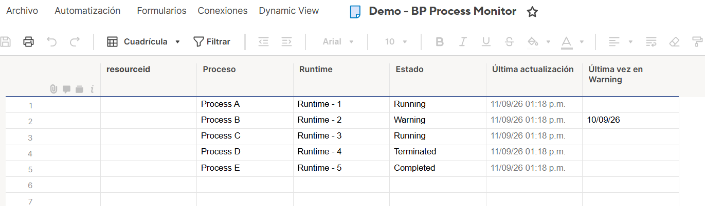
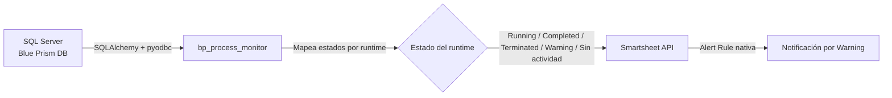

# BP Process Monitor


Pipeline en Python que monitorea en tiempo real la salud de los runtimes de **Blue Prism** consultando directamente la base de datos productiva (`BPAProcess` / `BPASession` / `BPAResource`), y sincroniza el estado de cada uno a una hoja de **Smartsheet**, con alertado nativo cuando un proceso queda en estado `Warning`.

Diseñado como **plantilla reutilizable**: no está atado a un cliente específico -- cualquier ambiente de Blue Prism puede monitorearse apuntando el pipeline a su propia base de datos y hoja de Smartsheet, sin tocar código.

---

## Vista del dashboard

El pipeline sincroniza el estado de cada runtime a Smartsheet, donde una Alert Rule nativa notifica automáticamente cuando algún proceso pasa a `Warning`:



---

## Cómo funciona



1. Consulta `BPASession` / `BPAProcess` / `BPAResource` en la base de datos productiva de Blue Prism.
2. Por cada runtime, determina su estado (`Running`, `Completed`, `Terminated`, `Warning`, `Stopped`, o `Sin actividad` si no tuvo sesiones recientes). Cuando un runtime tuvo más de un proceso en la ventana evaluada, se elige el más relevante (alerta primero, luego el más reciente).
3. Hace *upsert* en Smartsheet por nombre de runtime -- la hoja puede arrancar vacía y se va poblando sola.
4. Una Alert Rule nativa de Smartsheet dispara la notificación cuando el estado es `Warning` (Blue Prism ya alerta `Terminated` por su cuenta).
5. Corre desatendido cada 30 minutos vía Windows Task Scheduler, con logging rotativo y reintentos ante fallas transitorias de red (Smartsheet API).

---

## Stack técnico

| Componente | Tecnología |
|---|---|
| Lenguaje | Python 3.11+ |
| Acceso a datos | SQLAlchemy + pyodbc (SQL Server) |
| Sincronización | smartsheet-python-sdk |
| Configuración | pydantic-settings (`.env`) |
| Resiliencia | tenacity (retries con backoff) |
| Logging | `TimedRotatingFileHandler` (rotación semanal, retención configurable) |
| Testing | pytest + pytest-cov |
| Calidad de código | ruff (lint) + mypy --strict (tipos) |
| Despliegue | Windows Task Scheduler (ejecución desatendida cada 30 min) |

---

## Instalación

```bash
git clone https://github.com/iviermh77-byte/bp-process-monitor.git
cd bp-process-monitor

python -m venv .venv
.venv\Scripts\activate   # Windows

pip install -e ".[dev]"
```

## Configuración

Copia `.env.example` a `.env` y llena tus valores:

```bash
copy .env.example .env
```

| Variable | Descripción |
|---|---|
| `BP_DB_SERVER` | Host del SQL Server de Blue Prism |
| `BP_DB_NAME` | Nombre de la base de datos |
| `BP_DB_USER` / `BP_DB_PASSWORD` | Credenciales de un usuario de BD de **solo lectura** |
| `BP_DB_DRIVER` | Driver ODBC (default: `ODBC Driver 17 for SQL Server`) |
| `SMARTSHEET_API_KEY` | API key de Smartsheet |
| `SMARTSHEET_SHEET_ID` | ID de la hoja destino |
| `RUN_INTERVAL_MINUTES` | Minutos entre corridas (si se corre como proceso persistente) |
| `LOG_LEVEL` / `LOG_DIR` / `LOG_BACKUP_WEEKS` | Nivel, carpeta y retención de logs |

## Uso

```bash
bp-process-monitor
```

Corre una vez, sincroniza el estado actual a Smartsheet, y sale con código `0` (éxito) o `1` (falla, con traceback en el log). Pensado para dispararse periódicamente vía un scheduler externo (ver `deploy/register-scheduled-task.ps1` para Windows Task Scheduler).

## Tests

```bash
pytest                  # suite completa (excluye tests de integración contra BD real)
pytest -m integration   # incluye tests de integración (requiere BD accesible)
pytest --cov            # con reporte de cobertura
```

## Estructura del proyecto

```
bp-process-monitor/
├── src/bp_process_monitor/
│   ├── config.py              # Settings (pydantic-settings)
│   ├── db/
│   │   ├── connection.py
│   │   └── queries.py
│   ├── models.py
│   ├── services/
│   │   ├── process_monitor.py
│   │   └── smartsheet_sync.py
│   ├── logging_config.py
│   └── main.py
├── scripts/
│   └── smoke_test_db.py       # Smoke test manual contra la BD real (no es parte de pytest)
├── tests/
├── docs/
│   └── architecture.md
├── .env.example
└── pyproject.toml
```

## Roadmap

- [ ] Alertado activo ante fallo persistente del propio pipeline (correo/webhook cuando Task Scheduler agota reintentos).
- [ ] Alert Rule adicional en Smartsheet para el estado "Sin actividad".
- [ ] Métricas históricas (tiempo en cada estado por runtime).

## Licencia

MIT -- ver [LICENSE](LICENSE).

---

Desarrollado por **Ivier Morales** -- RPA Developer & Solution Designer (Blue Prism) explorando la integración de pipelines de datos/Python en soluciones de automatización empresarial.
